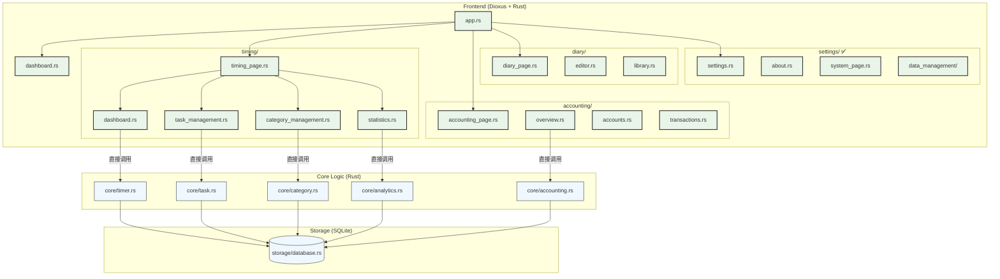
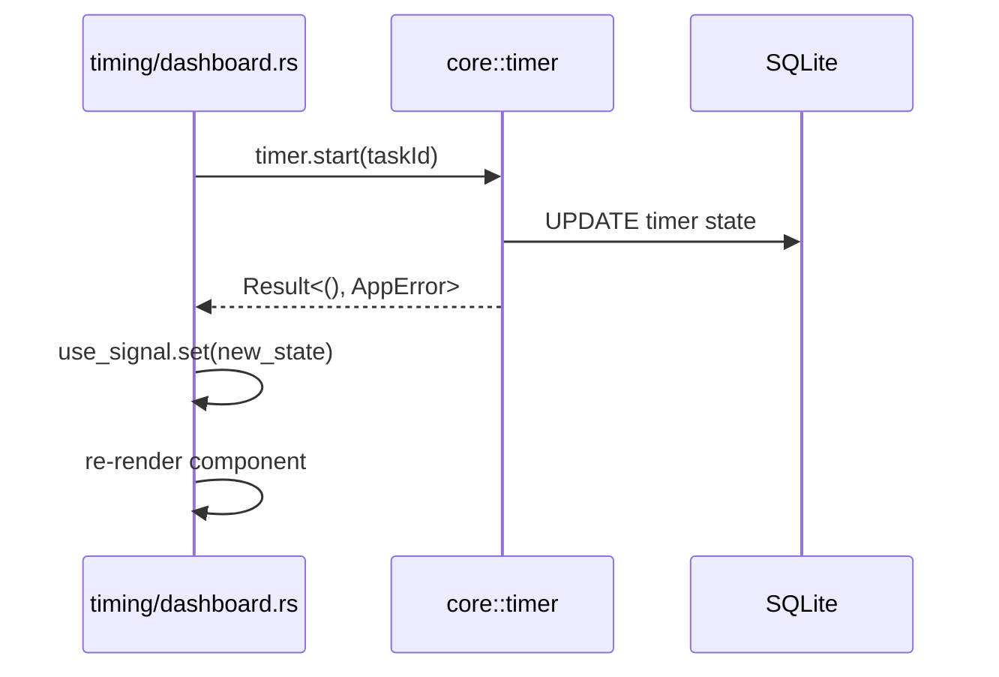

# 📚 LifeTracker 项目架构&功能实现全景指南

> [!INFO] 报告阅读指南  
> 本报告基于 **arc42** 12 大章节骨架进行裁剪，拆分为多份主题文档。每份文档同时满足：Emoji ✅ | Mermaid 图 ✅ | 表格 ✅ | Obsidian Callout ✅。  

---

## 1️⃣ 项目概览 & 目标 🚀

| 维度 | 内容 |
|------|------|
| 核心使命 | 打造“工作 + 生活 + 学习”一体化追踪桌面应用 |
| 主要功能 | ⏱️ 时间追踪 · 📝 日记 · 💰 财务 · 📈 数据分析 · ✅ 习惯打卡 |
| 关键质量目标 | 1. 离线优先⚡ 2. 跨平台🖥️ 3. 数据安全🔒 4. 可扩展🧩 |
| 关键利益相关者 | 终端用户、开发者、开源社区 |

> [!NOTE] 约束  
> - **技术**：Dioxus 0.6 + Rust + SQLite（从 Tauri+React 迁移中）  
> - **组织**：单人开发+社区贡献，需保持易维护性  
> - **架构**：模块化设计，单一职责，文件不超过500行  

---

## 2️⃣ 结构视图 🗂️ （Building Block View）

### 2.1 顶层模块关系图

上图梳理了 **前端 💻、核心逻辑 🦀、存储 🗄️** 三层。  
调用路径采用 _直接函数调用_ —— Dioxus 组件直接调用 Rust 核心逻辑，无需 JSON 序列化，性能更优。

### 2.2 模块描述表

| 层级 | 模块 | 主要文件 | 职责 | 交互接口 |
|------|------|----------|------|----------|
| Frontend | `app.rs` | `src/components/app.rs` | 主应用&路由 | ➡️ 子组件 |
|  | `timing/` | `src/components/timing/` | ⏱️ 时间追踪模块 | 直接调用 core |
|  | `accounting/` | `src/components/accounting/` | 💰 财务管理模块 | 直接调用 core |
|  | `diary/` | `src/components/diary/` | 📝 日记功能模块 | 直接调用 core |
|  | `settings/` | `src/components/settings/` | ⚙️ 设置管理模块 ✅ | 直接调用 core |
| Core Logic | `core/timer.rs` | 精确计时&状态机 | CRUD Timer ↔️ DB |
|  | `core/task.rs` | 任务管理逻辑 | 业务规则 ↔️ DB |
|  | `core/accounting.rs` | 财务业务逻辑 | 交易规则 ↔️ DB |
| Storage | `storage/database.rs` | 连接池 + migration | 提供事务化 API |

> [!TIP] 设计决策  
> - **模块化架构**：每个功能模块独立成目录，单一职责，文件不超过500行。  
> - **Dioxus 组件**：使用 Rust 原生组件，无需 JSON 序列化，性能更优。  
> - **业务逻辑分离**：所有业务规则在 `core/` 模块，UI 组件仅负责展示。  

---

## 3️⃣ 运行时视图 ⚙️ （Runtime View）

### 3.1 ⏱️ 计时器启动 Sequence

> [!INFO] 关键链路解析  
> 1. Dioxus 组件直接调用 `core::timer::start` → **无 JSON 序列化开销**。  
> 2. `core::timer` 进行参数校验，异步更新数据库。  
> 3. 更新 `tasks` 与 `timer_status` 两张表，确保 **ACID**。  
> 4. 返回 `Result` 直接给 UI，触发 `use_signal` 状态更新。

### 3.2 💰 财务流水录入简述

| 步骤 | 触发者 | 处理 | 结果 |
|------|--------|------|------|
| 1 | `accounting/transactions.rs` | 校验表单 | 直接调用 `core::accounting::add` |
| 2 | `core::accounting` | 插入 `accounting_entries` | 返回 `Result<id, AppError>` |
| 3 | UI | 接收结果，更新 `use_signal` | Toast ✅ |
| 4 | 组件 | 自动重新渲染 | 显示新记录 |

> [!WARNING] 一致性保证  
> 所有财务写操作均在 **单事务** 内完成；失败自动回滚，防止脏数据。

---

## 4️⃣ 部署视图 📦

| 环境 | 技术栈 | 描述 |
|------|--------|------|
| 开发 | Dioxus CLI + hot-reload | `dx serve` |
| 生产 | Dioxus bundle | Win / macOS / Linux / Web 自带 SQLite |
| CI/CD | GitHub Actions | Rust 矩阵构建，产物上传 Release |

---

## 5️⃣ 跨领域概念 🔄

> [!INFO] 统一错误处理  
> - Rust 端统一 `AppError` 实现 `thiserror::Error`  
> - Dioxus 组件直接处理 `Result` 类型，映射为用户友好提示  

> [!TIP] 主题系统  
> 使用 Dioxus 状态管理 + CSS 类名切换，状态持久化到 `config/theme.rs`，避免闪白。  

---

## 6️⃣ 质量&风险 🌲

| 分类 | 项 | 现状 | 风险 |
|------|----|------|------|
| 性能 | 初始化速度 | < 200 ms | SQLite I/O 峰值 |
| 安全 | 本地数据加密 | ❌ 待实现 | 数据泄露 |
| 技术债 | 缺少单元测试 | 🟡 部分核心已覆盖 | 回归风险 |

> [!NOTE] 后续改进  
> - 引入 **Sled** 或 **RocksDB** 可选引擎  
> - 完成 E2E 测试 & 加密功能  

---

## 7️⃣ 术语表 📖

| 术语 | 解释 |
|------|------|
| **Dioxus 组件** | Rust 原生 UI 组件，无需 JSON 序列化 |
| **Core 模块** | 纯业务逻辑，无 UI/IO |
| **use_signal** | Dioxus 响应式状态管理 |
| **TimerStatus** | { state, elapsed_seconds, total_today_seconds } |

---

### 🏁 总结

LifeTracker 采用 **模块化 + 单一职责** 的分层模式，在 **Dioxus** 架构内实现了"时间、财务、日记、习惯、统计"五大功能。  
通过本报告，你已获得：

1. 架构蓝图 🗺️  
2. 关键链路 Sequence ⚙️  
3. 模块&部署全貌 📦  

> [!INFO] 下一步  
> - 若需深入贡献，可优先阅读 `core/` 与 `components/` 模块。  
> - 遵循本文档中的 **设计原则 & 质量目标**，持续演进即可。