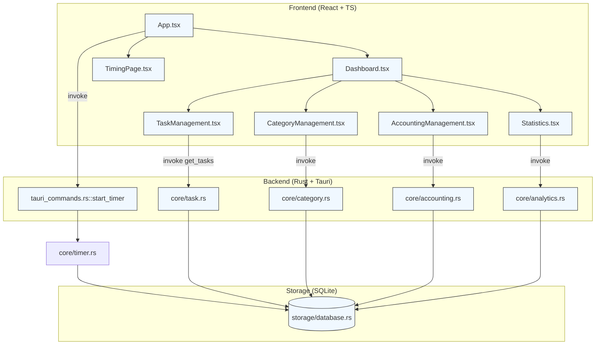
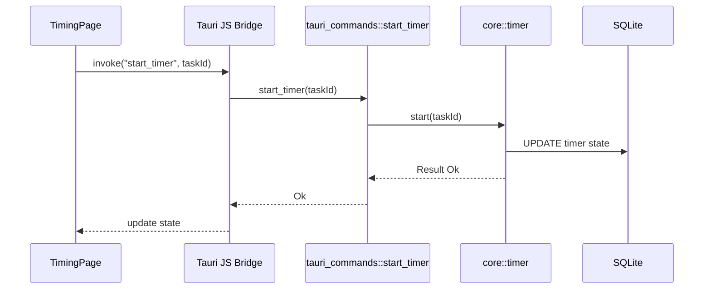

# 📚 LifeTracker 项目架构&功能实现全景指南

> [!INFO] 报告阅读指南  
> 本报告基于 **arc42** 12 大章节骨架进行裁剪，拆分为多份主题文档。每份文档同时满足：Emoji ✅ | Mermaid 图 ✅ | 表格 ✅ | Obsidian Callout ✅。  

---

## 1️⃣ 项目概览 & 目标 🚀

| 维度 | 内容 |
|------|------|
| 核心使命 | 打造“工作 + 生活 + 学习”一体化追踪桌面应用 |
| 主要功能 | ⏱️ 时间追踪 · 📝 日记 · 💰 财务 · 📈 数据分析 · ✅ 习惯打卡 |
| 关键质量目标 | 1. 离线优先⚡ 2. 跨平台🖥️ 3. 数据安全🔒 4. 可扩展🧩 |
| 关键利益相关者 | 终端用户、开发者、开源社区 |

> [!NOTE] 约束  
> - **技术**：Tauri+Rust，React18+TypeScript，SQLite  
> - **组织**：单人开发+社区贡献，需保持易维护性  

---

## 2️⃣ 结构视图 🗂️ （Building Block View）

### 2.1 顶层模块关系图

上图梳理了 **前端 💻、后端 🦀、存储 🗄️** 三层。  
调用路径采用 _Tauri invoke_ —— React 组件直接向 Rust 命令发送请求，Rust 模块再与 SQLite 交互。

### 2.2 模块描述表

| 层级 | 模块 | 主要文件 | 职责 | 交互接口 |
|------|------|----------|------|----------|
| Frontend | `Dashboard.tsx` | `src/components/Dashboard.tsx` | 首页路由&布局 | ➡️ 子组件 · invoke |
|  | `TimingPage.tsx` | ⏱️ 时间追踪 UI | invoke(`start_timer`,`get_timer_status`) |
| Backend | `core/timer.rs` | 精确计时&状态机 | CRUD Timer ↔️ DB |
|  | `tauri_commands.rs` | 暴露异步命令 | bridge UI ⇄ Core |
| Storage | `storage/database.rs` | 连接池 + migration | 提供事务化 API |

> [!TIP] 设计决策  
> - **无 Redux/Zustand**：小型状态直接用 React Hooks，降低复杂度。  
> - **Rust ↔️ UI 强隔离**：业务规则全部落在 Rust，前端仅显示。  

---

## 3️⃣ 运行时视图 ⚙️ （Runtime View）

### 3.1 ⏱️ 计时器启动 Sequence

> [!INFO] 关键链路解析  
> 1. UI 发起 `invoke("start_timer")` → **无前端业务逻辑**，只负责触发。  
> 2. `tauri_commands.rs::start_timer` 进行参数校验，异步进入 `core::timer::start`。  
> 3. `core::timer` 更新 `tasks` 与 `timer_status` 两张表，确保 **ACID**。  
> 4. 更新完成后广播事件回 UI，触发状态刷新。

### 3.2 💰 财务流水录入简述

| 步骤 | 触发者 | 处理 | 结果 |
|------|--------|------|------|
| 1 | `AccountingManagement.tsx` | 校验表单 | 调用 `invoke("add_transaction")` |
| 2 | `tauri_commands.rs` | JSON → Rust struct | `core::accounting::add` |
| 3 | `core::accounting` | 插入 `accounting_entries` | 返回 `id` |
| 4 | UI | 更新本地 cache | Toast ✅ |

> [!WARNING] 一致性保证  
> 所有财务写操作均在 **单事务** 内完成；失败自动回滚，防止脏数据。

---

## 4️⃣ 部署视图 📦

| 环境 | 技术栈 | 描述 |
|------|--------|------|
| 开发 | Vite + pnpm + hot-reload | `pnpm tauri:dev` |
| 生产 | Tauri bundle | Win / macOS / Linux 自带 SQLite |
| CI/CD | GitHub Actions | Rust + Node 矩阵构建，产物上传 Release |

---

## 5️⃣ 跨领域概念 🔄

> [!INFO] 统一错误处理  
> - Rust 端统一 `AppError` 实现 `thiserror::Error`  
> - 前端捕获 `invoke` 异常，映射为用户友好提示  

> [!TIP] 主题系统  
> `useTheme.tsx` + Tailwind `dark:`，状态持久化到 `config/theme.rs`，避免闪白。  

---

## 6️⃣ 质量&风险 🌲

| 分类 | 项 | 现状 | 风险 |
|------|----|------|------|
| 性能 | 初始化速度 | < 200 ms | SQLite I/O 峰值 |
| 安全 | 本地数据加密 | ❌ 待实现 | 数据泄露 |
| 技术债 | 缺少单元测试 | 🟡 部分核心已覆盖 | 回归风险 |

> [!NOTE] 后续改进  
> - 引入 **Sled** 或 **RocksDB** 可选引擎  
> - 完成 E2E 测试 & 加密功能  

---

## 7️⃣ 术语表 📖

| 术语 | 解释 |
|------|------|
| **Invoke** | Tauri JS Bridge 调用 Rust 命令 |
| **Core 模块** | 纯业务逻辑，无 UI/IO |
| **TimerStatus** | { state, elapsed_seconds, total_today_seconds } |

---

### 🏁 总结

LifeTracker 采用 **前端轻逻辑 + 后端强规则** 的分层模式，在 **单体 Tauri** 架构内实现了“时间、财务、日记、习惯、统计”五大功能。  
通过本报告，你已获得：

1. 架构蓝图 🗺️  
2. 关键链路 Sequence ⚙️  
3. 模块&部署全貌 📦  

> [!INFO] 下一步  
> - 若需深入贡献，可优先阅读 `core/` 与 `tauri_commands.rs`。  
> - 遵循本文档中的 **设计原则 & 质量目标**，持续演进即可。